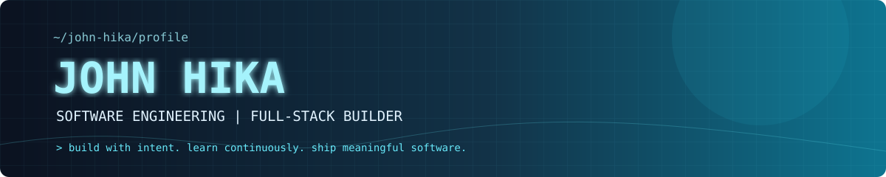
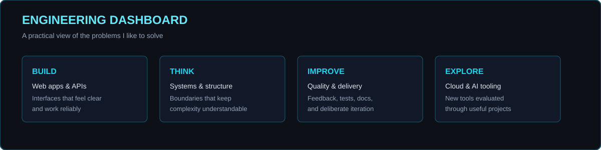
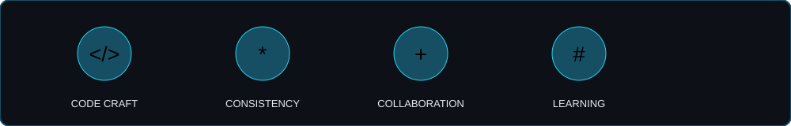

<div align="center">
  
</div>

<div align="center">
  
</div>

<p align="center"><a href="https://github.com/JohnHika">GitHub: JohnHika</a> &nbsp; | &nbsp; Software Engineering &nbsp; | &nbsp; Building in public</p>

<br />

```ts
const johnHika = {
  role: "Software Engineering Student",
  location: "Kenya",
  focus: ["Full-stack development", "System design", "Developer experience"],
  currentlyLearning: ["Cloud-native patterns", "AI-assisted software", "Distributed systems"],
  principle: "Make it work. Make it clear. Make it last.",
};
```

## About Me

I am a software engineering student and hands-on programmer focused on turning ideas into reliable, useful products. I enjoy the full development loop: understanding a problem, designing a solution, building the interface, connecting the services, and refining the details until the result feels solid.

My work is guided by readable code, intentional architecture, accessible interfaces, and continuous learning. I use this profile to document the tools I am exploring and the things I am shipping.

## What I Bring

<table>
  <tr>
    <td width="33%" valign="top"><h3>Build</h3><p>Responsive web apps, APIs, dashboards, and automation that are designed for real users.</p></td>
    <td width="33%" valign="top"><h3>Think</h3><p>Break complex problems into understandable systems, sensible interfaces, and testable pieces.</p></td>
    <td width="33%" valign="top"><h3>Improve</h3><p>Iterate through feedback, documentation, refactoring, and deliberate practice.</p></td>
  </tr>
</table>

## Current Engineering Focus

| Focus | What it means in practice |
| :-- | :-- |
| Product engineering | Taking features from idea to a maintainable, user-ready implementation |
| Full-stack systems | Connecting polished frontends to dependable APIs and data models |
| Software quality | Clear naming, sensible boundaries, useful tests, and repeatable delivery |
| Continuous learning | Exploring system design, cloud workflows, and practical AI tooling |

## Technology Stack

<div align="center">
  
</div>

<br />

<table>
  <tr><td><b>Languages</b></td><td>TypeScript, JavaScript, Python</td></tr>
  <tr><td><b>Frontend</b></td><td>React, Next.js, Tailwind CSS, responsive UI</td></tr>
  <tr><td><b>Backend</b></td><td>Node.js, REST APIs, PostgreSQL</td></tr>
  <tr><td><b>Tooling</b></td><td>Git, GitHub Actions, Docker, OpenAI tooling</td></tr>
  <tr><td><b>Practices</b></td><td>API design, component architecture, documentation, iterative delivery</td></tr>
</table>

## GitHub Dashboard

The profile is intentionally self-contained so the important visuals render reliably on GitHub without depending on third-party statistic services.

| Signal | What it represents |
| :-- | :-- |
| Code | Languages and tools used across public work |
| Delivery | Consistent iteration, documentation, and automation |
| Learning | New concepts tested through practical projects |
| Collaboration | Clear communication, useful reviews, and shared ownership |

## Achievements

<div align="center"></div>

## Contribution Activity

<div align="center"></div>

## Beyond the Terminal

I recharge with games and anime. Current favorites include **Renegade Immortal**, **Battle Through the Heavens**, **Solo Leveling**, and **Kaiju No. 8**. The same curiosity, strategy, and persistence I enjoy in those worlds shape the way I approach engineering.

## Connect

<div align="center"><a href="https://github.com/JohnHika">Follow John Hika on GitHub</a></div>

<br />

<div align="center">
  <sub>Build with intent. Learn continuously. Ship meaningful software.</sub>
</div>

<div align="center"><sub>Profile visuals are maintained in the repository so they do not disappear when an external widget is unavailable.</sub></div>

## A Developer's Working Loop

The best software usually starts before the first line of implementation. My preferred loop is intentionally simple and repeatable.

1. **Frame the problem**
   - Identify who needs the solution.
   - Write down the smallest useful outcome.
   - Separate a real requirement from a nice-to-have.
   - Note constraints before choosing tools.
   - Define how success can be observed.

2. **Shape the solution**
   - Sketch the user flow.
   - Name the data the system must own.
   - Choose boundaries that can change independently.
   - Prefer familiar patterns when they fit.
   - Record trade-offs while they are fresh.

3. **Build the thin slice**
   - Start with the path that proves the idea.
   - Keep the interface small and understandable.
   - Validate inputs at the boundary.
   - Make failure states visible.
   - Keep commits focused and reversible.

4. **Make it dependable**
   - Add tests around important behavior.
   - Review names, error messages, and edge cases.
   - Check keyboard and responsive behavior.
   - Document decisions that are not obvious.
   - Automate checks that should never be forgotten.

5. **Learn from the result**
   - Read feedback without defending the first version.
   - Measure what users actually do.
   - Remove complexity that does not earn its keep.
   - Keep a short list of the next highest-value improvements.
   - Share the lesson so the next project starts further ahead.

## Frontend Standards

Good frontend work is more than a collection of components. It is a usable system with clear states.

| Concern | Questions I ask |
| :-- | :-- |
| Layout | Does the hierarchy remain clear on a small screen? |
| Interaction | Can a user understand the result of every action? |
| States | Are loading, empty, error, and success states designed? |
| Accessibility | Can the experience be used with a keyboard and assistive technology? |
| Performance | Is the first useful view fast and stable? |
| Content | Are labels concrete, short, and honest? |
| Components | Is each component responsible for one understandable job? |
| Styling | Does visual emphasis match product importance? |

### Interface Checklist

- [ ] Navigation has a predictable order.
- [ ] Primary actions are visually distinct.
- [ ] Forms explain the expected input.
- [ ] Errors say how to recover.
- [ ] Buttons have a visible disabled state.
- [ ] Focus states are not removed.
- [ ] Text does not overflow its container.
- [ ] Images have useful alternative text.
- [ ] Motion has a purpose and a reduced-motion path.
- [ ] Tables remain readable on narrow screens.

## Backend Standards

When I build a service, I think about the contract first and the framework second.

- **Contracts:** Inputs and outputs are explicit.
- **Validation:** Invalid data is rejected close to the boundary.
- **Errors:** Failures are actionable without leaking sensitive details.
- **Persistence:** Data ownership and lifecycle are clear.
- **Observability:** Important operations can be traced and diagnosed.
- **Security:** Secrets are configuration, never source code.
- **Performance:** Expensive work is measured before it is optimized.
- **Evolution:** Breaking changes are intentional and communicated.
- **Testing:** Business rules can be exercised without a live browser.
- **Operations:** A new contributor can run the service locally.

## API Design Notes

```text
Request
  -> authenticate caller
  -> validate shape and permissions
  -> execute one clear use case
  -> persist the state transition
  -> return a stable response
  -> record useful diagnostic context
```

An endpoint should answer a useful question or complete a useful action. It should not expose internal database structure simply because that structure exists. I prefer small, composable contracts that leave room for the implementation to evolve.

## Quality Gates

Before calling a feature finished, I look for the following signals.

| Gate | Evidence |
| :-- | :-- |
| Correctness | The main path and important edge cases behave as expected. |
| Clarity | Another developer can find the entry point quickly. |
| Safety | Secrets, permissions, and user data are handled deliberately. |
| Usability | The interface explains what is happening and what comes next. |
| Maintainability | The change has a small surface area and a clear reason. |
| Delivery | Checks can run again in a clean environment. |

## Learning Roadmap

### Now

- Strengthen TypeScript fluency.
- Practice designing small but complete APIs.
- Improve responsive component architecture.
- Learn the trade-offs behind common system patterns.
- Use AI tools as accelerators while keeping engineering judgment human-led.

### Next

- Deploy a service with a repeatable cloud workflow.
- Add meaningful observability to a full-stack project.
- Compare relational and document data models in practice.
- Build a small event-driven feature.
- Contribute a focused improvement to an open-source project.

### Later

- Study distributed systems through implementation exercises.
- Design for graceful degradation and recovery.
- Explore platform engineering and internal developer tools.
- Mentor another learner through a complete project.
- Turn project notes into reusable technical writing.

## Project Blueprint

When a new idea arrives, this is the shape I use to make it concrete.

### Problem

- Who experiences the problem?
- How often does it happen?
- What does the current workaround cost?
- What would a better outcome look like?

### Scope

- What is the smallest useful release?
- Which behavior is deliberately out of scope?
- What assumptions need validation?
- What can be postponed without creating risk?

### Design

- What are the primary user actions?
- Which state belongs to the client?
- Which state belongs to the server?
- Where should validation live?
- What happens when a dependency is unavailable?

### Delivery

- Can another developer run it from the README?
- Is the environment configuration documented?
- Are checks automated?
- Is the change easy to review?
- Is the deployment path understood?

### Reflection

- What worked better than expected?
- Where did complexity appear?
- What would I change with a second pass?
- What did the project teach me?
- What can become a reusable pattern?

## Useful Repository Habits

| Habit | Why it matters |
| :-- | :-- |
| Small commits | They preserve intent and make review easier. |
| Descriptive names | They reduce the amount of context a reader must hold. |
| Short documentation | It keeps important knowledge close to the code. |
| Reproducible setup | It turns onboarding from guesswork into a process. |
| Explicit trade-offs | It makes future changes safer. |
| Regular cleanup | It prevents temporary decisions becoming permanent architecture. |

## What I Am Looking For

I am interested in opportunities where I can learn from experienced engineers, contribute to products that matter, and take ownership of meaningful pieces of work. I value teams that communicate clearly, review code thoughtfully, and care about the people who use what they build.

I bring curiosity, persistence, and a willingness to do the unglamorous work that makes software dependable: reading documentation, tracing bugs, improving naming, writing tests, and documenting the decision that future me will otherwise have to rediscover.

## Profile Notes

- This profile is a living workbench, not a static résumé.
- New tools appear here after I have used them for something practical.
- Learning notes are kept close to the projects that produced them.
- Personal interests remain here because good engineering is done by whole people.
- Every section should help a visitor understand how I think and what I can build.

## Quick Reference

```text
Name       John Hika
Role       Software Engineering Student
Focus      Full-stack web engineering
Languages  TypeScript | JavaScript | Python
Frontend   React | Next.js | Tailwind CSS
Backend    Node.js | REST APIs | PostgreSQL
Delivery   Git | Docker | GitHub Actions
Learning   System design | Cloud-native patterns | AI tooling
Interests  Games | Anime | Developer tools | Problem solving
```

## Thank You For Visiting

Whether you are here to review code, explore an idea, or connect with another learner, I hope this profile gives you a useful sense of the person behind the commits. The goal is simple: keep learning, keep building, and leave every project clearer than I found it.

## Software Engineering Field Notes

These are the small reminders I want close when I am deep in a build.

01. A clear requirement is cheaper than a clever fix.
02. The first interface is a conversation, not a contract.
03. Name the user outcome before naming the component.
04. A smaller scope creates faster feedback.
05. Boundaries are valuable when they explain ownership.
06. Validation belongs close to the boundary.
07. Errors are part of the product experience.
08. Empty states deserve the same care as full states.
09. A loading spinner cannot repair a slow design.
10. A test should explain behavior, not implementation.
11. Documentation is a tool for reducing repeated questions.
12. Logs are most useful when they explain a decision.
13. Metrics should answer a question someone actually has.
14. A dependency is also a maintenance decision.
15. Simplicity is a feature with a long shelf life.
16. Abstractions should earn their place.
17. Copying a pattern is fine; copying assumptions is risky.
18. Read the error message completely before changing code.
19. Reproduce a bug before attempting to solve it.
20. Fix the cause, then protect it with a regression test.
21. Prefer explicit data flow over hidden magic.
22. Keep side effects near the edge of the system.
23. Make the happy path easy to see.
24. Make the failure path safe to understand.
25. Keep functions small enough to name honestly.
26. A good name removes the need for a comment.
27. A good comment explains why, not what.
28. Avoid returning a shape that changes without warning.
29. A migration is part of the feature.
30. Backups are part of the data model.
31. Permissions should be checked where actions are authorized.
32. Secrets do not belong in screenshots or commits.
33. User input should never be trusted by default.
34. Security decisions deserve written reasoning.
35. Performance work starts with measurement.
36. Caching adds a second state to reason about.
37. Retries need a limit and an idempotency story.
38. Timeouts are better than requests that wait forever.
39. A queue changes how failure needs to be handled.
40. A database constraint can protect more than an application check.
41. A component API is a public API in miniature.
42. Consistent spacing communicates system quality.
43. Responsive behavior is a requirement, not a polish pass.
44. Accessible markup is often the simplest markup.
45. Keyboard support reveals interaction problems early.
46. Focus visibility should survive every theme.
47. Motion should clarify change, never hide it.
48. Contrast is a usability tool.
49. Content hierarchy is part of information architecture.
50. Every button should communicate an action.
51. Every destructive action should communicate its cost.
52. A form should make the valid path obvious.
53. A field error should appear where the user can act on it.
54. Avoid making users remember information the interface can show.
55. Preserve user input when a request fails.
56. Optimistic UI needs a recovery plan.
57. A disabled control should explain why it is unavailable.
58. Tables need a mobile strategy.
59. Long words should not break a layout.
60. Images should have a purpose and a useful fallback.
61. A README is part of the developer experience.
62. Setup steps should be tested on a clean machine.
63. Environment variables need examples and safe defaults.
64. Scripts should have names that reveal their intent.
65. CI should fail for reasons a contributor can fix.
66. Fast checks should run before slow checks.
67. Formatting is valuable when it removes discussion.
68. Review comments should improve the code, not perform authority.
69. Ask questions before assuming intent.
70. Explain trade-offs when the choice is not obvious.
71. A focused pull request is easier to trust.
72. Small releases reduce the size of surprises.
73. Changelogs preserve context for future users.
74. Versioning is a communication tool.
75. A deprecation path is part of a mature API.
76. Delete code when its reason for existing is gone.
77. Technical debt is a decision, not a moral failure.
78. Track debt where it can be revisited.
79. Refactor when the next change would otherwise be confusing.
80. Avoid refactoring unrelated code during a focused fix.
81. Learn the framework, but keep the domain in plain language.
82. Understand the runtime beneath the abstraction.
83. Read primary documentation for important behavior.
84. Build small experiments when a concept is unclear.
85. Keep experiments separate from production decisions.
86. Compare tools by the problem they solve.
87. New technology needs a reason beyond novelty.
88. AI can accelerate exploration; judgment still owns the result.
89. Generated code deserves the same review as handwritten code.
90. Verify external claims before building around them.
91. A prototype should make its limitations visible.
92. A production system should make its assumptions visible.
93. Reliability is a property of the whole path.
94. Ownership is clearer when responsibilities are named.
95. Collaboration improves when context is shared early.
96. Feedback is data about the current version.
97. A second pair of eyes catches expensive assumptions.
98. Teaching a concept is a useful test of understanding.
99. Progress is easier to see when work is written down.
100. Keep shipping things that make the next thing easier.

## Review Checklist

### Before Opening A Pull Request

- [ ] The change has a specific purpose.
- [ ] The smallest useful behavior is implemented.
- [ ] Naming matches the domain language.
- [ ] The main user path is easy to follow.
- [ ] The failure path is understandable.
- [ ] Tests cover the important behavior.
- [ ] No secrets or private data are included.
- [ ] Documentation matches the current behavior.
- [ ] The diff does not include unrelated cleanup.
- [ ] The project can still be started from a clean checkout.

### During Review

- [ ] Ask whether the design matches the problem.
- [ ] Check boundaries and data ownership.
- [ ] Check permission and validation paths.
- [ ] Check empty, loading, and error states.
- [ ] Check responsive and keyboard behavior.
- [ ] Check migration and rollback implications.
- [ ] Check observability and useful diagnostics.
- [ ] Check long-term maintenance cost.

### After Merge

- [ ] Confirm the expected result in the target environment.
- [ ] Watch for new errors or unexpected usage.
- [ ] Record follow-up work while context is fresh.
- [ ] Update documentation if the workflow changed.
- [ ] Remove temporary flags when they are no longer needed.

## Small Things I Am Practicing

- Writing a concise design note before implementation.
- Explaining an architectural trade-off in plain language.
- Making a component useful without making it generic too early.
- Turning a bug report into a reproducible test case.
- Using database constraints as a second line of defense.
- Designing interfaces that remain calm under failure.
- Keeping a project setup guide current as the project changes.
- Measuring before optimizing.
- Reviewing my own diff as if I were a new contributor.
- Finishing the documentation after the feature, not weeks later.

## Closing Signal

```text
ready_to_build       true
curiosity             high
scope                 intentional
feedback              welcome
quality_bar           rising
next_commit           loading...
```

## Working Glossary

| Term | My practical interpretation |
| :-- | :-- |
| Boundary | A clear place where responsibility changes. |
| Contract | The behavior another part of the system can rely on. |
| Coupling | A reason one change forces another change. |
| Cohesion | How closely related the responsibilities in one unit are. |
| Idempotency | Repeating an operation does not create an unintended extra effect. |
| Invariant | A rule that must remain true after a state change. |
| Latency | The time between asking for something and receiving a useful result. |
| Observability | The ability to understand a running system from its outputs. |
| Resilience | The ability to keep useful behavior when part of a system fails. |
| Regression | A previously working behavior that stopped working. |
| Refactoring | Improving internal structure without changing intended behavior. |
| Scope | The behavior a change intentionally includes. |
| State | Information that influences what the system does next. |
| Trade-off | A conscious gain that comes with a cost. |
| Vertical slice | A small feature that crosses the necessary layers end to end. |
| Verification | Evidence that the implementation matches its intended behavior. |
| Rollback | A controlled way to return to a known working version. |
| Migration | A deliberate change to stored data or its structure. |
| Dependency | An external capability the project relies on. |
| Fixture | Stable input used to make a test repeatable. |
| Mock | A controlled substitute used to isolate behavior under test. |
| Endpoint | A defined entry point into a service. |
| Component | A reusable interface unit with a focused responsibility. |
| Accessibility | Designing so more people can use the product successfully. |
| Progressive enhancement | Starting with useful fundamentals, then adding capability. |
| Feedback loop | The time between making a change and learning from its result. |
| Technical debt | A shortcut that creates a future cost worth tracking. |
| Developer experience | How easy it is for engineers to understand and change a system. |
| User experience | How effectively and confidently a person can reach an outcome. |
| Failure mode | A specific way an operation can produce an unwanted result. |
| Recovery | The action that returns a system or user to a useful state. |
| Release | A deliberate, communicated delivery of a change. |
| Feature flag | A control that separates code deployment from behavior exposure. |
| Audit trail | A record of important actions and state transitions. |
| Rate limit | A boundary that protects a service from excessive work. |
| Timeout | A limit that prevents waiting forever for a dependency. |
| Retry | A second attempt with rules about when it is safe. |
| Queue | A buffer that separates producers from consumers of work. |
| Cache | Stored data used to avoid repeating an expensive operation. |
| Schema | A shared description of data shape and constraints. |
| Query | A request for data or a derived view of data. |
| Transaction | A group of changes that should succeed or fail together. |
| Concurrency | Multiple operations making progress during the same period. |
| Consistency | How closely different readers observe the same state. |
| Availability | How often a useful service can be reached. |
| Security boundary | A place where identity or permission must be checked. |
| Secret | Sensitive configuration that must not be committed. |
| Threat model | A written view of what could go wrong and who might cause it. |
| Principle | A guideline that helps decisions stay consistent. |
| Experiment | A small implementation designed to answer one question. |
| Prototype | A deliberately incomplete version used to learn quickly. |
| Product | A maintained solution that creates value for people. |
| Craft | Attention to the details that make software trustworthy. |

## A Note On The Number Of Lines

This profile is intentionally detailed because a programmer's profile should show more than a list of logos. It should communicate how the person thinks, how they work, what they are learning, and what quality means to them. The sections above are working notes, not claims of seniority or a substitute for shipped work. They are a visible commitment to practice.

The code examples, checklists, and principles are designed to be useful to another learner too. A profile should be welcoming to a recruiter, understandable to a teammate, and honest to the person maintaining it. That is the standard I am aiming for here.

## Project Status Template

When a project grows, I use a compact status note to keep its direction visible.

```text
project_name       [name]
problem            [one sentence]
primary_user       [who benefits]
current_stage      [idea | prototype | building | shipped | maintaining]
next_milestone     [the next observable outcome]
known_risks        [the assumptions that need attention]
data_owner         [the part of the system that owns each state change]
failure_plan       [what the user sees when a dependency fails]
test_signal        [the behavior that proves the feature works]
delivery_signal    [the check that keeps it working after release]
documentation      [the page or note a new contributor should read]
last_reviewed      [date]
```

## Questions I Ask Before Saying Done

1. Can I explain the feature without pointing at the implementation?
2. Can a new contributor run it without guessing?
3. Can a user recover when the happy path fails?
4. Can the system tell me what happened after the fact?
5. Can I change one part without surprising another part?
6. Are the important rules protected by tests or constraints?
7. Does the interface work for more than the fastest user?
8. Is the scope small enough that the result can be reviewed honestly?
9. Did I record the trade-off that future me might question?
10. Does this release make the next release easier?

## Long-Term Direction

- Grow from building features to shaping dependable systems.
- Grow from using tools to understanding their trade-offs.
- Grow from completing tasks to owning outcomes.
- Grow from receiving feedback to actively seeking it.
- Grow from keeping notes privately to sharing useful lessons.
- Grow from solving one bug to preventing a class of bugs.
- Grow from learning syntax to learning boundaries.
- Grow from copying examples to designing experiments.
- Grow from shipping quickly to shipping with confidence.
- Grow from a personal workflow into a collaborative engineering practice.

## Personal Definition Of Progress

Progress is a clearer mental model.

Progress is a smaller unexplained surface area.

Progress is a test that catches a real regression.

Progress is an interface that removes one moment of confusion.

Progress is a setup step that no longer needs a private explanation.

Progress is a bug report that arrives with useful context.

Progress is a review conversation that improves the result.

Progress is a project that teaches a reusable idea.

Progress is a commit that makes the next commit more deliberate.

Progress is showing up again with better questions.

Progress is work that remains useful after the excitement of the first release has passed.

Progress is a profile that tells the truth and still makes room to grow.

Progress is a useful README, a thoughtful commit, and a better question tomorrow.

Progress is built one deliberate iteration at a time.
